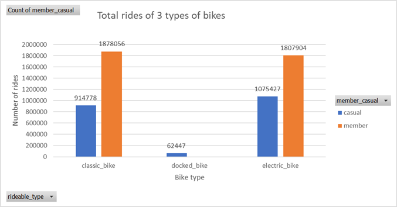
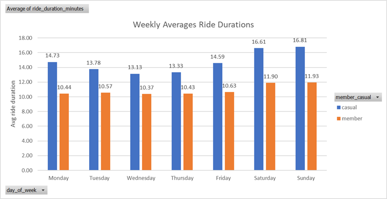
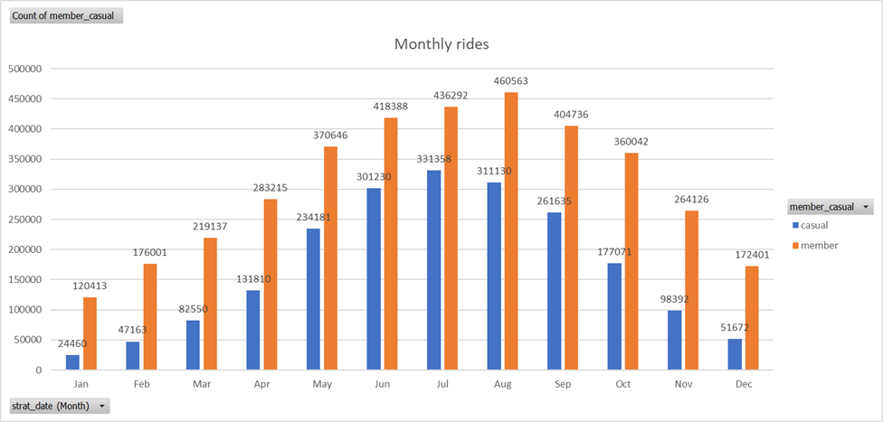

# Cyclistic Bike-Share Analysis using Excel and Power Query

## Table of Contents
- [Project Overview](#project-overview)
- [Data Overview](#data-overview)
- [Project Objectives](#project-objectives)
- [Tools Used](#tools-used)
- [Data Cleaning and Preparation](#data-cleaning-and-preparation)
- [Exploratory Data Analysis](#exploratory-data-analysis)
- [Project Structure](#project-structure)
- [Key Insights](#key-insights)
- [Recommendations](#recommendations)
- [Data Limitations](#data-limitations)
- [How to Use](#how-to-use)

### Project Overview
Cyclistic is a fictional Chicago-based bike-share company launched in 2016. Operates 5,800 geo-tracked cycles with 692 stations across Chicago.

Pricing Plans:
- Single Ride Pass
- Full Day Pass
- Annual Memberships

In this project, customers who purchase Single Ride Passes or Full Day Passes are classified as **Casual Riders**, while those with annual memberships are classified as **Members**.

This project analyses Cyclistic bike-share data using Excel Pivot Tables and Power Query. The goal is to understand how casual riders and annual members use the service differently and provide actionable insights to increase annual memberships.

### Data Overview:
- **Source:** Data was provided by a real company for educational, research, and analysis purposes.
- **Period:** May 2023 to April 2024.
- **Volume:** 5.7 million rows of data.
- **Format:** .csv

### Project Objectives:
- Understand how annual members and casual riders use Cyclistic bikes differently.
- Identify key insights to drive marketing strategies for converting casual riders.
- Provide actionable recommendations for improving ridership and revenue.

### Tools Used:
- **Power Query** : Used for cleaning, transforming, and consolidating raw data.
- **Excel Pivot Tables** : Used for summarizing and analyzing key insights from the dataset.
- **Excel Charts** : For visualizing insights (e.g., bike type usage, average ride duration).

### Data Cleaning and Preparation
In the initial data preparation phase, we performed the following task:
1. Data loading and inspections
2. Handling missing values
3. Data cleaning and formatting

### Exploratory Data Analysis
EDA involves exploring the data to answer the key questions such as,
- How annual members and casual riders use Cyclistic bikes differently.
- Identify key insights to drive marketing strategies for converting casual riders.
- Provide actionable recommendations for improving ridership and revenue.

### Project Structure
- **data/:** Contains a sample cleaned dataset for demonstration purposes and data_dictionary.md file explains the dataset structure and columns.
- **visuals/:** Includes charts created using Excel.
- **README.md:** Provides project overview and instructions.

    
  **( To access the full dataset, download it from the following link:
          [Download Full Dataset from Google Drive](https://drive.google.com/drive/folders/1pDlVomP16qkL_pa7kGGE6aRn0noNl-qJ?usp=sharing) )**
  

### Key Insights:
The analysis key insights are summarised as follows : 
1. **Bike Type Usage:**
      
    - Casual riders prefer classic and electric bikes.
    - Members have balanced usage across all bike types.
      
      
      
3. **Ride Duration:**
    - Casual riders take longer rides, especially on weekends.
    - Members tend to use bikes for shorter, consistent weekday rides.

      
      
4. **Monthly Trends:**
    - Summer months show peak usage for both casual riders and members.
      
      

For more charts, visit the [`visuals/`](visuals/) folder.

### Recommendations:
Base on the analysis, the following actions are recommended : 

1. **Targeted Marketing Campaigns:**
    - Launch weekend and summer promotions tailored to casual riders.
    - Highlight cost savings of annual memberships for frequent or long-duration riders.
2. **Leverage Local Content Creators:**
    - Collaborate with Chicago-based influencers and content creators to showcase bike-share trips around the city.
    - Focus on promoting Cyclistic as a fun, eco-friendly, and affordable way to explore Chicago.
    - Use user-generated content to improve Cyclistic’s brand image and attract younger, tech-savvy audiences.
3. **Flexible Membership Options:**
    - Introduce shorter-term memberships, such as monthly or weekend-only plans, to cater to hesitant casual riders.
    - Offer family packages or group discounts to broaden appeal.
4. **Enhance Customer Engagement:**
    - Launch a loyalty program for both casual and annual riders to reward frequent use.
    - Gather customer feedback through surveys and use it to improve services.

### Data Limitations
- Purpose of the ride is not available.
- Pricing structure is not included, limiting cost-benefit analysis.
- Fleet distribution and docking station context are missing.
- No demographic data for users to segment effectively.
    #### Suggestions:
    - Conduct surveys to collect ride purpose.
    - Incorporate pricing and station data into future datasets.
    - Explore demographic data collection for better user targeting.

### How to Use
1. **Data Cleaning:**
   - Download the Full Dataset from Google Drive to access the complete data processed using Power Query.
   - The cleaned dataset includes all necessary transformations, such as null handling, date parsing, and calculated fields (e.g., ride duration).
2. **Analysis:**
   - Open `analysed_data.xlsx` (downloaded from Google Drive) to explore the analysis.
   - This file contains Pivot tables summarizing key insights and Embedded charts for visualizing these insights
3. **Visualizations:**
   - For a quick overview, view `.png` files in the `visuals/` folder within the repository.
   - Each chart highlights a specific aspect of the analysis.

